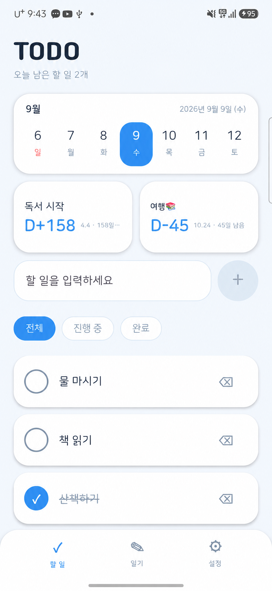
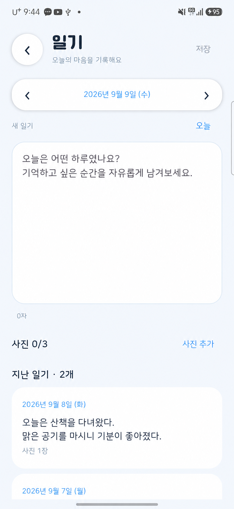
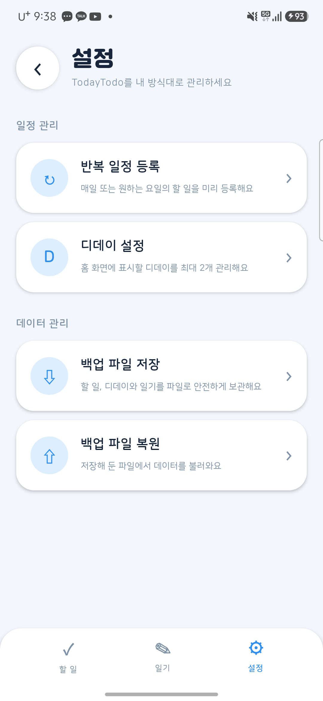
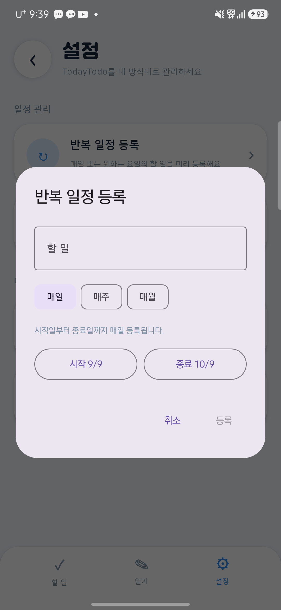
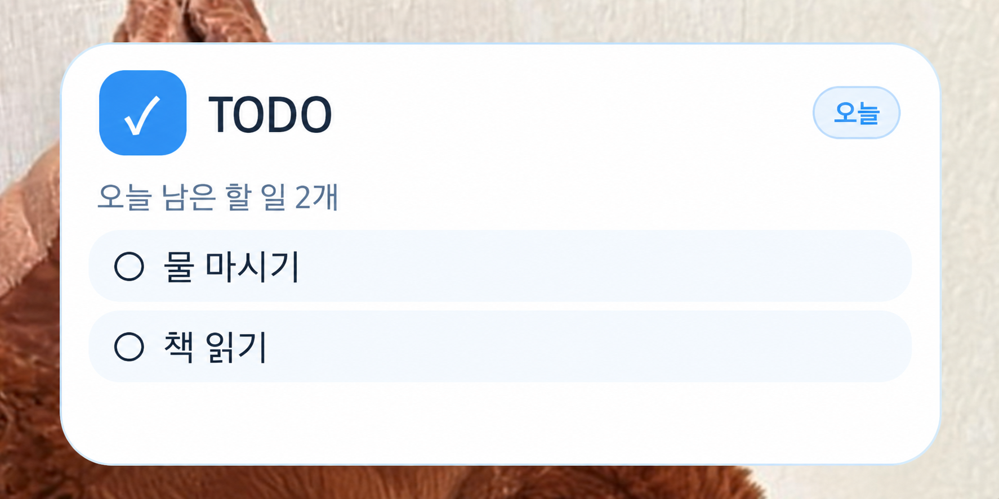

# TodayTodo

날짜별 할 일, 사진 일기, 반복 일정, 디데이와 미완료 알림을 관리하는 개인용 Android 앱입니다.

로그인과 인터넷 연결 없이 사용할 수 있으며, 작성한 내용은 휴대폰에 저장됩니다.

## 앱 화면

| 홈 · 할 일 | 일기 |
| :---: | :---: |
|  |  |
| 날짜별 할 일과 디데이를 한눈에 | 하루의 기록과 사진을 함께 보관 |

| 설정 | 반복 일정 등록 |
| :---: | :---: |
|  |  |
| 일정 관리와 백업·복원을 한곳에서 | 반복 방식과 기간을 정해 일정 등록 |

### 홈 화면 위젯

앱을 열지 않아도 오늘의 미완료 개수와 할 일을 확인할 수 있습니다. 위젯을 누르면 앱이 열립니다.

## 주요 기능

### 날짜별 일기

- 하단 **일기** 메뉴에서 선택한 날짜의 일기 작성·수정·저장
- 날짜 양옆 화살표 또는 날짜 버튼의 달력으로 날짜 선택
- 지난 일기 목록에서 저장된 일기 다시 열기
- 일기마다 사진 최대 3장 추가, 미리보기 및 개별 삭제 (사진만 저장 가능)
- 사진은 긴 변 최대 1,600px로 앱에 복사되며, 원본을 삭제해도 유지됩니다. 백업 파일에도 사진이 포함됩니다.
- 저장하지 않고 이동할 때 저장 또는 변경 취소 확인
- 삭제 확인 후 일기 삭제
- 작성 중 내용은 화면 회전 시 유지되며, 저장한 일기는 앱을 다시 실행해도 유지
- 기존 백업에 일기도 포함됩니다. 이전 버전 백업도 복원할 수 있으며, 같은 날짜의 일기가 있으면 현재 일기를 유지합니다.

### 날짜별 할 일

- 이전·다음 버튼으로 날짜 이동
- 달력에서 과거 또는 미래 날짜 직접 선택
- 선택한 날짜에 할 일 등록
- 완료 체크 및 취소
- 전체·진행 중·완료 필터
- 앱을 종료해도 목록 유지

### 미완료 알림

- 당일 오후 10시에 미완료 항목이 있을 때 알림 표시
- 미완료 개수와 할 일 제목을 최대 3개까지 표시
- 알림을 누르면 앱 실행
- 휴대폰 재부팅 후 다음 알림 자동 예약

Android 13 이상에서는 최초 실행 시 알림 권한을 허용해야 합니다. 배터리 절전 상태에 따라 알림이 몇 분 정도 늦어질 수 있습니다.

### 디데이

- 디데이 최대 2개 등록
- 이름과 날짜 수정 및 삭제
- 미래 날짜는 `D-10`, 당일은 `D-DAY`, 지난 날짜는 `D+3` 형식으로 표시
- 홈 화면 상단에 컴팩트한 KPI 카드로 표시

하단 **설정** 메뉴에서 **디데이 설정**을 선택해 관리할 수 있습니다.

### 반복 일정

하단 **설정** 메뉴의 **반복 일정 등록**에서 제목, 반복 방식, 시작일과 종료일을 설정할 수 있습니다.

- **매일**: 시작일부터 종료일까지 매일 등록
- **매주**: 선택한 요일마다 등록, 여러 요일 선택 가능
- **매월**: 시작일과 같은 날짜에 매월 등록

매월 반복에서 해당 날짜가 없는 달은 그 달의 마지막 날로 자동 조정됩니다. 반복 항목을 삭제할 때는 다음 중 하나를 선택할 수 있습니다.

- **이 일정만 삭제**: 선택한 날짜의 항목만 삭제
- **전체 삭제**: 같은 반복 일정으로 만든 모든 항목을 한 번에 삭제

### 백업 및 복원

하단 **설정** 메뉴에서 다음 기능을 사용할 수 있습니다.

- **백업 파일 저장**: 전체 데이터를 JSON 파일로 저장
- **백업 파일 복원**: 백업 데이터를 현재 데이터와 안전하게 합치기

백업에는 모든 할 일, 날짜, 완료 여부, 반복 일정 항목, 디데이와 일기·사진이 포함됩니다. 같은 백업을 여러 번 복원해도 동일한 할 일이 중복으로 추가되지 않습니다.

### 홈 화면 위젯

- 오늘의 미완료 개수와 할 일 최대 3개 표시
- 위젯을 누르면 TodayTodo 실행
- 앱에서 할 일을 변경하면 위젯 내용 자동 갱신

갤럭시 홈 화면의 빈 곳을 길게 누른 후 **위젯 → 오늘할일 → 추가**를 선택하면 됩니다.

## 사용 방법

1. 가운데 날짜 버튼을 눌러 날짜를 선택합니다.
2. 입력란에 할 일을 작성하고 **+** 버튼을 누릅니다.
3. 완료한 항목은 체크박스를 누릅니다.
4. 항목을 지우려면 오른쪽 삭제 아이콘을 누른 후 확인창에서 삭제를 선택합니다.
5. 다른 날짜를 보고 있을 때 **오늘로 돌아가기**를 누르면 오늘 날짜로 이동합니다.
